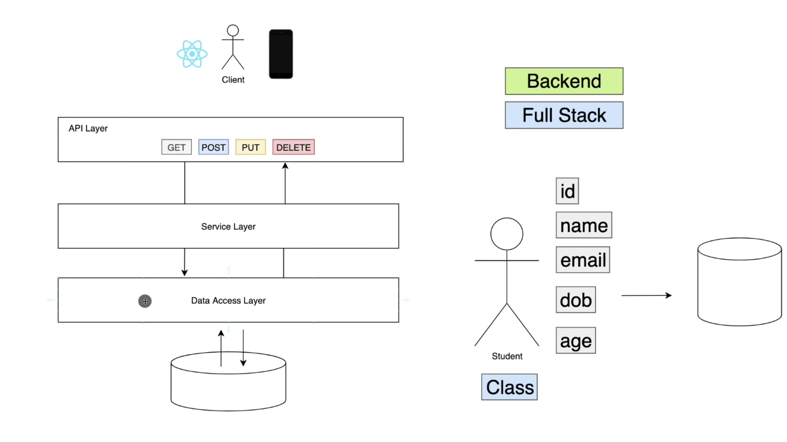

# students-rest-api-spring-boot

## Architecture

## Tools
- Java 17
- Maven build tools
- Postgresql

## Postgres
- Commands:
- `brew services start postgresql`
- `psql postgres`
- `CREATE DATABASE student;`
- `GRANT ALL PRIVILEGES ON DATABASE "student" TO {username};`
- `\c student`
- `brew services stop postgresql`

## Running the packaged .jar application
- `java -jar target/students-0.0.1-SNAPSHOT.jar --server.port=8080`
### Reference Documentation
For further reference, please consider the following sections:

* [Official Apache Maven documentation](https://maven.apache.org/guides/index.html)
* [Spring Boot Maven Plugin Reference Guide](https://docs.spring.io/spring-boot/docs/3.1.5/maven-plugin/reference/html/)
* [Create an OCI image](https://docs.spring.io/spring-boot/docs/3.1.5/maven-plugin/reference/html/#build-image)
* [Spring Web](https://docs.spring.io/spring-boot/docs/3.1.5/reference/htmlsingle/index.html#web)
* [Spring Data JPA](https://docs.spring.io/spring-boot/docs/3.1.5/reference/htmlsingle/index.html#data.sql.jpa-and-spring-data)

### Guides
The following guides illustrate how to use some features concretely:

* [Building a RESTful Web Service](https://spring.io/guides/gs/rest-service/)
* [Serving Web Content with Spring MVC](https://spring.io/guides/gs/serving-web-content/)
* [Building REST services with Spring](https://spring.io/guides/tutorials/rest/)
* [Accessing Data with JPA](https://spring.io/guides/gs/accessing-data-jpa/)